# PlayJev

[](https://omnijev.github.io/PlayJev/)
[](https://huggingface.co/Qwen/Qwen3.5-0.8B-Base)
[](#the-ten-games)
[](#how-a-decision-is-made)
[](LICENSE)

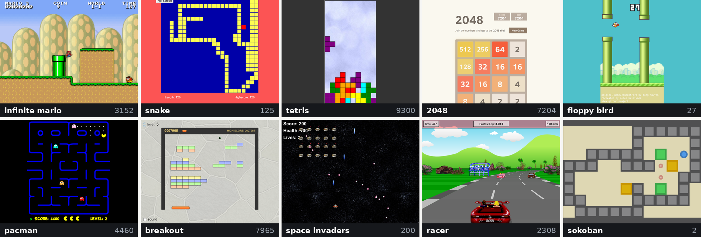

Every picture above is the trained model playing. Each is a frame from a recorded held-out episode
with the score it had reached by then, and the [live demo](https://omnijev.github.io/PlayJev/) replays
those same episodes in the real game, step by step, with the probabilities drawn beside the picture.

An open System One model that plays ten classic browser games from raw pixels. PlayJev is
Qwen3.5-0.8B-Base fine-tuned so that one forward pass turns a game frame into a calibrated
probability over the game's moves. Nothing is generated and nothing is parsed: the answer is read
from the option-letter logits, the same contract as Jev's Choice primitive and the same confidence
formula. A decision takes 43 ms on one H200 at batch 1, about twice as fast as the games' own step, and
the same GPU serves about 140 decisions per second when several games run at once.

```
frame (JPEG, 448 px) ─┐
                      ├─► one forward pass ─► letter logits ─► softmax ─► {up: 0.05, down: 0.02, left: 0.90, right: 0.03}, confidence 0.87
option list ──────────┘
```

The demo source is in `demo/`, built by `scripts/build_demo.py` from the games and the recorded runs.
Serve that directory and open `index.html` to run it locally.

## Why pixels

Every Jev-shaped game demo before this one feeds the model text. TypeSafe's Mario demo parses the
emulator's RAM into JSON and states that the model does not receive screenshots; the open-jev Doom
demo describes each frame in one line of text; the zero-shot pixel attempts play one game without
training. VideoGameBench and lmgame-Bench run frontier models with reasoning loops at seconds per
move. PlayJev trains a small vision-language model under the Jev contract and plays ten games from
the frame alone, in real time, with a probability the game loop can trust.

## Results

Three models, all Qwen3.5-0.8B-Base and each one model for all ten games. `sft_all1` is one epoch of behaviour
cloning on 863k teacher-labelled frames (about 100k per game, 4 h 11 min on one H200). `dagger1` and `dagger2` are
two DAgger rounds on top of it: the current model plays 40k frames per game, the teachers label every frame it
visited, and the model trains one more epoch (lr 1e-5) on those plus the earlier shards (3 h 10 min and 4 h 20 min).
Closed loop on 16 held-out episodes per game, argmax move, episodes capped at 1500 steps; random and teacher play
the same seeds through the same harness. "vs teacher" is (model - random) / (teacher - random): 0 is random play,
1 is the teacher.

<picture>
  <source media="(prefers-color-scheme: dark)" srcset="docs/assets/chart-dark.png">
  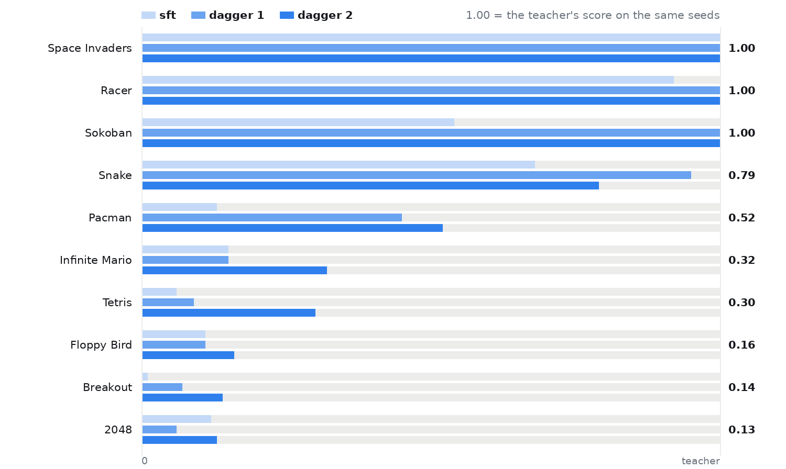
</picture>

| game | random | sft_all1 | dagger1 | dagger2 | teacher | vs teacher, sft_all1 | dagger1 | dagger2 |
|---|---:|---:|---:|---:|---:|---:|---:|---:|
| Space Invaders | 215 | 400 | 400 | 400 | 400 | 1.00 | 1.00 | **1.00** |
| Racer | 238 | 6211 | 6704 | 6707 | 6712 | 0.92 | 1.00 | **1.00** |
| Sokoban | 6.6 | 57.9 | 102.3 | 102.1 | 102.2 | 0.54 | 1.00 | **1.00** |
| Snake | 1.0 | 77.8 | **107.9** | 89.5 | 114 | 0.68 | **0.95** | 0.79 |
| Pacman | 113 | 1036 | 3209 | 3702 | 7026 | 0.13 | 0.45 | **0.52** |
| Infinite Mario | 613 | 1156 | 1170 | 1764 | 4229 | 0.15 | 0.15 | **0.32** |
| Tetris | 162 | 1034 | 1561 | 4718 | 15288 | 0.06 | 0.09 | **0.30** |
| Floppy Bird | 0.0 | 8.9 | 9.3 | 13.8 | 84.0 | 0.11 | 0.11 | **0.16** |
| Breakout | 496 | 611 | 1552 | 2712 | 16547 | 0.01 | 0.07 | **0.14** |
| 2048 | 1021 | 3174 | 2170 | 3386 | 19593 | 0.12 | 0.06 | **0.13** |
| mean | | | | | | 0.37 | 0.49 | **0.53** |

Zero-shot, the base model puts 0.7 on option A whatever the frame. After one epoch every game is above random.
The DAgger rounds separate the games by what was wrong:

- Sokoban, Racer, Snake and Pacman were covariate shift: the cloned policy reproduced the teacher on the teacher's
  own frames (0.95, 0.84, 0.99 and 0.87 agreement) and lost it on its own (0.91, 0.56, 0.93, 0.92 on its own play,
  with the errors concentrated where they cost most). One round of labels on the model's own states brings three of
  them to the teacher's level and triples Pacman; the three saturated ones hold through round 2.
- Snake goes the other way in round 2, 107.9 to 89.5, the only column in the table that does. It is a real
  regression and not 16-episode noise: on the 14 held-out seeds the two rounds share, round 2 is lower on 12, the
  paired difference is -17.4 with sd 22.5, and a sign-flip permutation test over 200,000 permutations puts it at
  p = 0.0073. Mean episode length falls with the score, 455 steps to 348, which is what a snake regression looks
  like: the model dies earlier, so it eats less. Both agreement instruments miss it. Validation agreement is flat
  (.780 to .775) and on-policy agreement, measured by replaying the recorded episodes through the real game with
  the teacher watching, *rises* more for snake than for any other game (.722 to .824). The reason is that agreement
  is averaged over the frames the model visits and those frames changed: total steps over the same 16 episodes fell
  7275 to 5568, so the average shifts toward the easy early game, where a three-segment snake on an empty board has
  almost no way to be wrong. In a fatal-on-mistake game, agreement can move against the score. Only the closed loop
  sees it.
- Breakout and Mario need motion. On the teacher's frames the paddle is already under the ball's landing point, so
  the cloned policy learned to read the paddle instead of the ball (16 percent agreement on its own play); DAgger
  raises that to 47 percent and the score 2.5x, and round 2 doubles both again (Breakout 0.07 to 0.14, Mario 0.15
  to 0.32). A single frame still does not show the ball's direction, nor Mario's velocity and jump phase, and how
  the second frame is delivered decides who benefits. Merged into the vision tower's temporal patch it adds nothing
  outside Breakout. Passed as two separate images the model can compare by attention, Breakout gains validation
  agreement at every eval point (+.096 on average, the largest effect in the ablation) while Mario and Racer lose at
  every point. Those two are the only games in the roster whose camera translates: the frame difference is dominated
  by the global shift of the scene, which the model has to discount before any local motion means anything. For a
  fixed camera the frame difference *is* the object that moved. Stacking through the patch convolution mixes the
  translation into every patch embedding, which is why the merged version looked flat overall.
- Floppy Bird and Tetris are precision. Flappy reproduces the teacher on 99.8 percent of frames and dies at 9 pipes
  on the one missed correction (a second consecutive flap); Tetris drops pieces one move early. Forty thousand
  on-policy frames contain a few hundred of those moments, so round 1 barely moves them. Round 2 triples Tetris
  (0.09 to 0.30) and lifts Flappy to 0.16.
- 2048 is a reading problem (tile digits at 448 px): 0.48 agreement either way, and the model knows it, its
  confidence there is 0.25. Two rounds take it from 0.06 to 0.13, still the bottom of the table.

**Execution rule.** A move that leaves the observation unchanged (a blocked direction in 2048 or Sokoban is a legal
no-op) is not repeated on that observation; the next most probable move is taken. Without it, a deterministic
policy that picks a blocked direction loops to the step cap (2048 scored 54 that way). The rule never fires in the
games whose frames change every step; their numbers are identical with and without it.

**Latency.** The same model applied one step late (the decision from frame k acts at step k+1, the real-time
setting at 83 to 100 ms per step) collapses in the reflex games: Snake 11, Tetris 248, Breakout 394, Flappy 0.2,
Pacman 502; Invaders 400 and Racer 5885 barely move. Training on shifted labels (`--label-delay 1`, frame k
labelled with the teacher's decision at k+1) helps exactly the games whose next decision follows from the current
frame: Snake 11 to 20, Tetris 248 to 306, Breakout 394 to 636, Flappy 0.2 to 2.3, 2048 2191 to 3195. It hurts the
ones whose next decision depends on what the current move does to the board: Mario 820 to 242 (standing still to
the cap in half the episodes), Pacman 502 to 236, Racer 5885 to 5116, Sokoban at random level either way. So the
shift has to be per game, and even where it helps, the real-time score stays a fraction of the undelayed one:
latency has to be attacked in the model too, which is what the second frame is for.

### Does it read the option text?

On 400 validation frames per game, with the prompt otherwise unchanged (`scripts/probe_options.py`):

- shuffling the options changes nothing (the training permutes them every sample);
- replacing the names by neutral words (alpha, bravo, ...) and keeping the descriptions loses 0 to 2 points in six
  games, 7 in Tetris, 8 in Racer, 13 in Invaders;
- keeping only the names loses nothing, even in Snake, 2048, Pacman and Sokoban, whose names are the same four
  words: which "up" it is comes from the frame;
- rotating the descriptions one option along while the names stay: the decision follows the description in Flappy
  (84 percent), Sokoban (67) and Racer (47), the name in Breakout (95), Mario (82) and Pacman (80), and splits in
  Snake and Tetris. Both halves of the option text are read; a fixed classification head cannot be moved by editing
  a sentence;
- an extra fake option ("hold: keep the current move and do nothing new") gets 2 to 9 percent of the mass in seven
  games and 13 to 18 in the three the model is least sure about (2048, Invaders, Breakout).

The same probes on a model that never learned to look (an eight-game run without Snake that settled on a text-only
policy, see the anchor note below) come out the opposite way: when names and descriptions conflict it follows the
name 100 percent of the time in every game, neutral names collapse it to chance in Flappy and Breakout, and its
agreement is at chance wherever a name alone does not give the move away.

**Anchor game.** That eight-game mix (Snake and Racer held out) reproduced the failure with two seeds: five games
never left the letter prior and the other three converged to "the most common move for this option list", with the
image pathway unused. With Snake back in the mix (Racer and Pacman held out instead) every game reads the frame by
step 1500, as in the ten-game run. Snake's labels are the ones with no text shortcut (a BFS arrow, uniform over the
four options, decided by the board alone), and one such game in the mix is what forces the frame to be read.

### Is the confidence worth anything?

Low-confidence steps are where the errors are: on the model's own play, Tetris agrees with the teacher on 36
percent of the steps with confidence below 0.5 and 61 percent overall; Invaders 41 percent against 97 percent on
steps above 0.9; Racer 34 against 97; Sokoban 3 against 94. The operational test is a System Two behind the model:
whenever the Jev confidence is below a threshold, the decision is handed to the teacher (`playjev.play --handover`),
and the control hands the same share of steps over at random (`--handover-random`). `sft_all1`, 16 episodes per
setting:

| game | model alone | share of steps handed over | by confidence | at random, same share | teacher alone |
|---|---:|---:|---:|---:|---:|
| Breakout | 701 | 16% | **3423** | 1257 | 16547 |
| | | 34% | **15139** | 6192 | |
| Tetris | 1054 | 14% | **2976** | 1610 | 15288 |
| | | 33% | **9109** | 3177 | |
| | | 63% | **15156** | 8473 | |
| Pacman | 1029 | 16% | **1739** | 1594 | 7026 |
| | | 22% | **3573** | 2947 | |
| Snake | 77 | 38% | **90** | 82 | 114 |
| | | 53% | **112** | 92 | |
| Floppy Bird | 8.9 | 3% | **14.4** | | 84 |
| | | 18% | **38.9** | | |
| 2048 | 3009 | 32% | **6322** | | 19593 |
| Racer | 6214 | 11% | **6634** | | 6712 |
| | | 39% | **6712** | | |

Handing over a third of Breakout's steps by confidence reaches the teacher's level; the same share at random gets
a third of the way. The confidence picks the steps that matter, which is what a System One is for: it knows which
decisions to keep and which to pass on. Sokoban is the exception (34 percent handed over, 58 to 71): its failures are
boards the model has already deadlocked, and no later decision repairs them.

## The ten games

All plain HTML5/JS, vendored under `games/<id>/` with their licences and a `vendor.patch` where we changed a file.
Each game exposes the same tiny hook (`window.pj`: `start(seed)`, `step(action)`, `frame()`, `score()`, `done()`,
`actions`), and the same page serves as environment and demo.

|   | game | upstream | licence | moves |
|---|---|---|---|---|
| 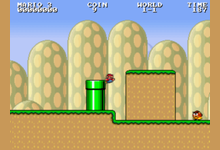 | Infinite Mario | [robertkleffner/mariohtml5](https://github.com/robertkleffner/mariohtml5) | Unlicense (code) | noop, left, right, jump, right jump, right run, right run jump |
| 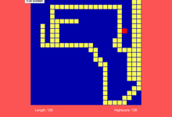 | Snake | [patorjk/JavaScript-Snake](https://github.com/patorjk/JavaScript-Snake) | MIT | up, down, left, right |
| 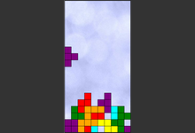 | Tetris | [jakesgordon/javascript-tetris](https://github.com/jakesgordon/javascript-tetris) | MIT | left, right, rotate, drop, none |
| 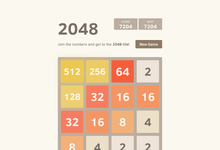 | 2048 | [gabrielecirulli/2048](https://github.com/gabrielecirulli/2048) | MIT | up, down, left, right |
| 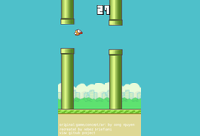 | Floppy Bird | [nebez/floppybird](https://github.com/nebez/floppybird) | Apache-2.0 (code) | flap, wait |
| 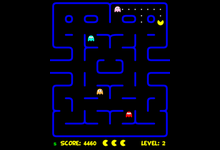 | Pacman | [daleharvey/pacman](https://github.com/daleharvey/pacman) | WTFPL (code) | up, down, left, right |
| 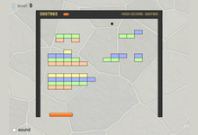 | Breakout | [jakesgordon/javascript-breakout](https://github.com/jakesgordon/javascript-breakout) | MIT | left, right, stay |
| 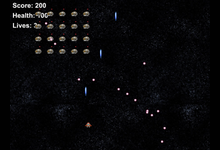 | Space Invaders | [StrykerKKD/SpaceInvaders](https://github.com/StrykerKKD/SpaceInvaders) | MIT | left, right, noop |
| 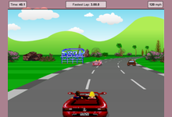 | Javascript Racer | [jakesgordon/javascript-racer](https://github.com/jakesgordon/javascript-racer) | MIT (code) | left, right, faster, slower, left faster, right faster |
| 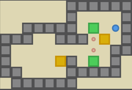 | Sokoban | [taniarascia/sokoban](https://github.com/taniarascia/sokoban), Microban levels by David Skinner | MIT | up, down, left, right |

Three of the upstream projects say in their own READMEs that their art is not theirs to license. Infinite Mario's
sprites are Nintendo's, Floppy Bird's are extracted from the original Android game and are Dong Nguyen's and
.GEARS', and the Racer's are placeholder art borrowed from the Mega Drive version of OutRun. The licence in the
table covers the code each author wrote. No audio ships here at all: every sound and music file was removed from
the roster, which costs nothing, because the driver already aborted every audio request (`playjev/env.py`), the
shim forces media elements muted and Chromium runs with `--mute-audio`. Not one frame in this repository, training
or demo, was ever produced with sound.

## How a decision is made

The model never sees a game's name. It sees the current frame and the option list, rendered with the frozen
OpenJev prompt, and its answer is the next token after `Answer:`.

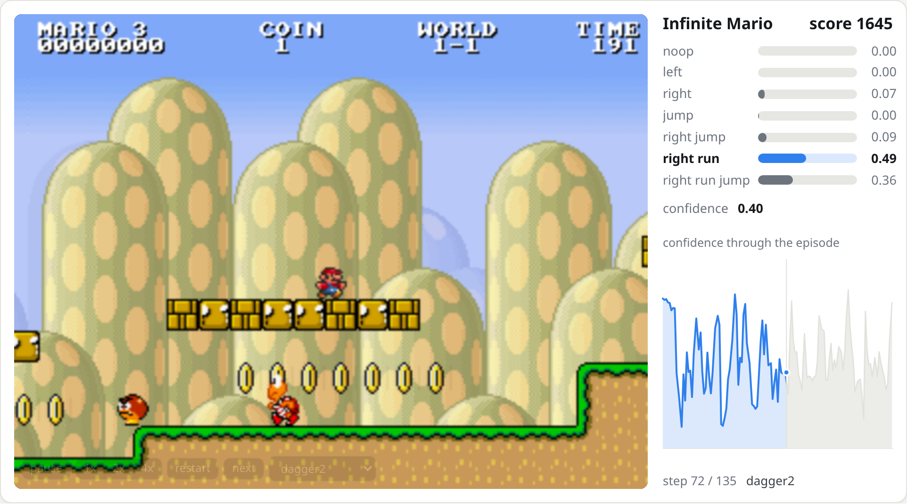

This is the demo's single game view, and it is the whole model in one picture: the frame on the left is the
only input, the bars on the right are the seven numbers that come out of the forward pass, and the line below
them is how sure the model was at every step of the episode so far.

```
Apply the question to the state. Choose exactly one of the listed options. Respond with only its uppercase letter, with no explanation or reasoning.

<state>
<|vision_start|><|image_pad|><|vision_end|>
</state>

Question: Which move should the player make next?

Options:
A. up: turn the snake to move up
B. down: turn the snake to move down
C. left: turn the snake to move left
D. right: turn the snake to move right

Answer with one letter: A, B, C, D.
Answer:
```

The frame goes in as visual tokens (182 for a 448x416 snake frame). The probability over moves is the float32
softmax over the K letter logits at the last position; confidence is `(p_max - 1/K) / (1 - 1/K)`, Jev's formula,
so 0 is a uniform guess and 1 is certainty. Options are shuffled for every training sample, so the model cannot
learn a letter prior. One frame per decision by default; the vision tower's two-frame temporal patch takes the
previous frame too, without extra tokens, for games where velocity matters.

## Training recipe

1. **Teachers.** One program per game plays on the game's internal state (grids, coordinates, velocities, which
   the model never sees): BFS for Snake, expectimax for 2048, Dellacherie placement search for Tetris, A* with
   deadlock pruning for Sokoban, exact physics search for Floppy Bird, ghost-occupancy propagation for Pacman,
   ball-flight simulation for Breakout, a dodge-and-aim DP for Space Invaders, lookahead steering for the Racer,
   and physics rollouts for Mario. Each returns a soft target: 0.9 on the best move (split on ties), 0.1 spread
   over acceptable moves, 0 on moves that lose. Teacher scores are in [docs/BASELINES.md](docs/BASELINES.md).
2. **Collection.** Teachers play with 2 to 30 percent random moves so the data covers recoveries, and the label is
   always the teacher's own judgement of the frame (DAgger-style). 100k frames per game, 448 px JPEGs, three
   shards per game collected in parallel on the CPU cores next to the GPU.
3. **Supervised fine-tuning.** Full fine-tuning of the 0.8B model, cross-entropy between the teacher distribution
   and the model's softmax over the letter slots, one epoch over the ten games mixed, batch 64, learning rate 2e-5,
   fp32 master weights with bf16 autocast. About 4 hours on one H200 for the ten-game model.
4. **Closed loop.** The trained model plays 16 held-out episodes per game through the same harness, argmax move,
   against a random policy and the teacher on the same seeds. Validation also reports agreement with the teacher,
   ECE and Brier of the chosen move's probability, and the per-letter position bias.

Details, curves and every number: [docs/TRAIN_NOTES.md](docs/TRAIN_NOTES.md) and
[docs/MODEL_NOTES.md](docs/MODEL_NOTES.md).

## Run it

Python 3.12, Playwright's Chromium for the games, and a CUDA GPU for training and play (the 0.8B model fits in
about 3 GB for inference and 17 GB for training with batch 64).

```bash
git clone https://github.com/OmniJev/PlayJev && cd PlayJev
python -m venv .venv && . .venv/bin/activate
pip install -r requirements.txt && playwright install chromium

python -m playjev.bench snake --pages 8 --steps 200         # the harness: random play, env-steps per second
python -m playjev.teacher_eval snake --episodes 16         # the teacher's score on held-out seeds
python -m playjev.collect snake --steps 4000 --shard s0    # (frame, teacher target) pairs under data/snake/s0
python -m playjev.train_sft --games snake --model Qwen/Qwen3.5-0.8B-Base --out ckpt/snake1
python -m playjev.play snake --policy local --ckpt ckpt/snake1/final --record runs/replays
```

`playjev.play --policy teacher` and `--policy random` give the two reference rows; `--delay 1` applies each
decision one step late, the real-time latency model. The HPC job scripts we used are under `hpc/`.

Serving: `python -m playjev.serve --ckpt ckpt/snake1/final --port 18732` exposes the checkpoint at
`/v1/systemone` in the OpenJev request shape with frames as the state
(`{"state": {"frames": ["data:image/jpeg;base64,..."]}, "questions": {"q": {"type": "choice", "criteria": {...}}}}`).
`playjev.play --policy server --url http://127.0.0.1:18732/v1/systemone` plays through it, and the demo page switches
every tile to that server with `?server=http://127.0.0.1:18732`.

## Repository

```
games/<id>/        vendored game, pj.json manifest, pj_hook.js, NOTES.md, TEACHER.md
games/_shared/     pj_shim.js: virtual clock, seeded Math.random, synthetic keys, frame grab
playjev/           env.py (Playwright driver), collect.py, teachers/, model.py, data.py, train_sft.py, play.py, serve.py
demo/              the GitHub Pages site; scripts/build_demo.py assembles it from games/ and runs/replays/
docs/              HARNESS.md (the hook contract), DESIGN.md, BASELINES.md, MODEL_NOTES.md, TRAIN_NOTES.md
hpc/               PBS job scripts for collection, training and closed-loop play
```

## Related

[OpenJev](https://github.com/OmniJev/openJev), the text-state System One server this model plugs into, and
[Awesome-JEV](https://github.com/OmniJev/awesome-jev), the reading list behind System One models.

## Licence

Code and trained weights: Apache-2.0. The games keep their own licences, one file per game under `games/<id>/`,
and the note under the roster says which of them cover the code only.
