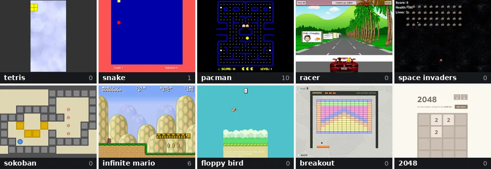
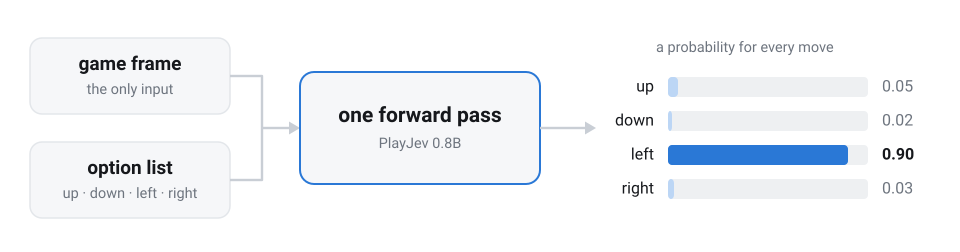
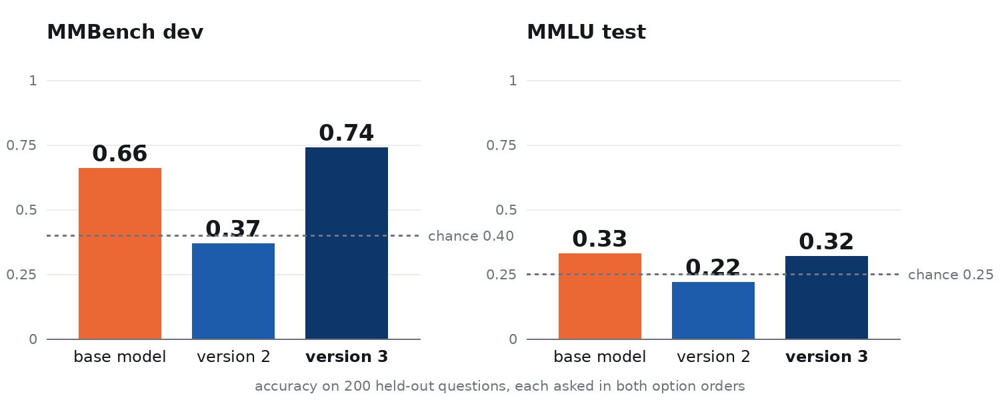
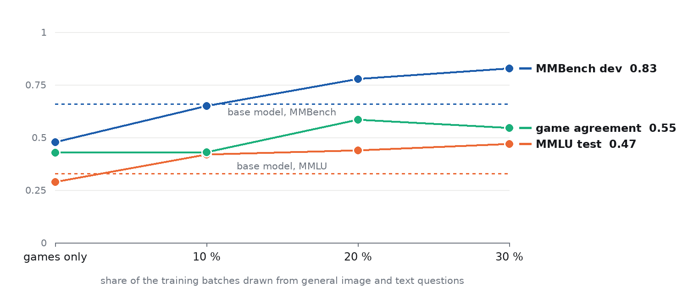
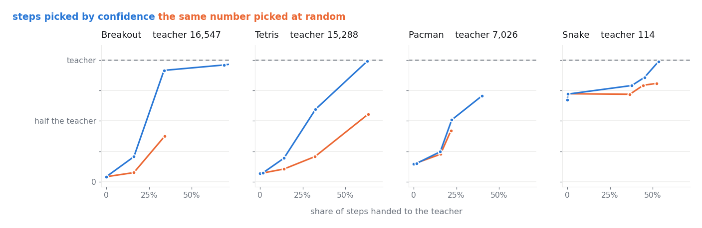
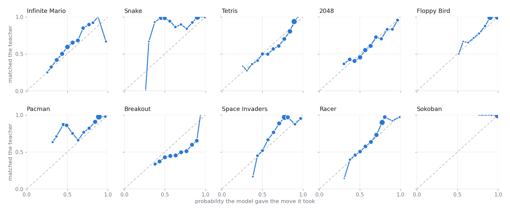
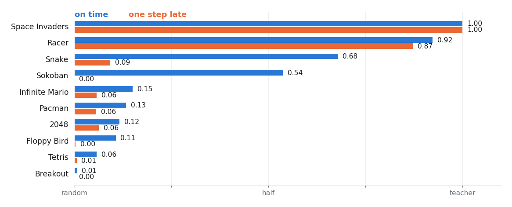

<p align="center">
  
</p>

<h1 align="center">PlayJev: A Multimodal JEV-Like Model for Small Games</h1>

<p align="center">
  <a href="https://omnijev.github.io/PlayJev/"></a>
  <a href="https://huggingface.co/spaces/OmniJev/PlayJev"></a>
  <a href="https://huggingface.co/OmniJev/PlayJev-0.8B"></a>
  <a href="#-how-a-decision-is-made"></a>
  <a href="#-results"></a>
</p>

<p align="center">
  
  
  <a href="https://github.com/OmniJev/openJev"></a>
  <a href="LICENSE"></a>
</p>

<h2 align="center">🎮 &nbsp;<a href="https://omnijev.github.io/PlayJev/">Show the live demo</a>&nbsp; 🎮</h2>

PlayJev is Qwen3.5-0.8B-Base fine-tuned to play ten classic browser games from raw pixels. One frame goes in,
one forward pass runs, one move comes out, 43 ms on an H200. Every picture above is the trained model playing,
each a frame from a recorded held-out episode with the score it had reached by then. The weights are on
[Hugging Face](https://huggingface.co/OmniJev/PlayJev-0.8B).

## 🎮 The Ten Games

Plain HTML5/JS with one hook each (`window.pj`: `start(seed)`, `step(action)`, `frame()`, `score()`, `done()`,
`actions`), and the same page is both training environment and demo tile. Every tile below opens that game on
the demo, with the model playing it.

<table align="center">
  <tr>
    <td align="center"><a href="https://omnijev.github.io/PlayJev/?game=tetris"><br><b>Tetris</b></a><br>5 moves</td>
    <td align="center"><a href="https://omnijev.github.io/PlayJev/?game=snake"><br><b>Snake</b></a><br>4 moves</td>
    <td align="center"><a href="https://omnijev.github.io/PlayJev/?game=pacman"><br><b>Pacman</b></a><br>4 moves</td>
    <td align="center"><a href="https://omnijev.github.io/PlayJev/?game=racer"><br><b>Javascript Racer</b></a><br>6 moves</td>
    <td align="center"><a href="https://omnijev.github.io/PlayJev/?game=invaders"><br><b>Space Invaders</b></a><br>3 moves</td>
  </tr>
  <tr>
    <td align="center"><a href="https://omnijev.github.io/PlayJev/?game=sokoban"><br><b>Sokoban</b></a><br>4 moves</td>
    <td align="center"><a href="https://omnijev.github.io/PlayJev/?game=mario"><br><b>Infinite Mario</b></a><br>7 moves</td>
    <td align="center"><a href="https://omnijev.github.io/PlayJev/?game=flappy"><br><b>Floppy Bird</b></a><br>2 moves</td>
    <td align="center"><a href="https://omnijev.github.io/PlayJev/?game=breakout"><br><b>Breakout</b></a><br>3 moves</td>
    <td align="center"><a href="https://omnijev.github.io/PlayJev/?game=2048"><br><b>2048</b></a><br>4 moves</td>
  </tr>
</table>

## 🔍 Why Pixels

Every Jev-shaped game demo before this one feeds the model text. TypeSafe's Mario parses emulator RAM into
JSON and says the model gets no screenshots, the open-jev Doom demo writes one line of text per frame, and
VideoGameBench and lmgame-Bench run frontier models with reasoning loops at seconds per move. PlayJev plays
ten games from the frame alone, in real time, and returns a probability the game loop can act on.

## 🧠 How a Decision Is Made

The model never sees a game's name. It sees the current frame and the list of moves, and it answers with one
of them.

<picture>
  <source media="(prefers-color-scheme: dark)" srcset="docs/assets/decision-flow-dark.svg">
  
</picture>


The demo's single game view is the whole model in one picture: the frame on the left is the only input, the
bars are what the forward pass returns, the line below them is how sure it was at every step so far. Moves are
shuffled in every training sample, so position carries no information. One frame per decision: these weights
see a single still image. The vision tower's temporal patch of 2 can carry a second frame at no extra token
cost, and this release leaves that off. The prompt is built in
[playjev/model.py](playjev/model.py), and the demo prints the exact one for every game.

## ▶️ Run It

The model plays a game, one command:

```bash
python -m playjev.play snake --policy local --ckpt OmniJev/PlayJev-0.8B --episodes 1
```

It pulls the weights from Hugging Face, opens Snake in headless Chromium and plays it. There is no dataset to
download: the ten games are in this repository and `scripts/reproduce.sh` regenerates every training frame here,
from the teachers through three DAgger rounds to the closed-loop score. Setup once (Python 3.12,
a CUDA GPU, about 3 GB for inference and 17 GB for training at batch 64):

```bash
git clone https://github.com/OmniJev/PlayJev && cd PlayJev
python -m venv .venv && . .venv/bin/activate
pip install -r requirements.txt && playwright install chromium
```

| Command | What it does |
|---|---|
| `playjev.play <game> --policy teacher` (or `random`) | the two reference rows; `--delay 1` decides one step late |
| `playjev.collect <game> --steps 4000 --shard s0` | (frame, teacher target) pairs under `data/<game>/s0` |
| `playjev.train_sft --games <game> --model Qwen/Qwen3.5-0.8B-Base --out ckpt/x` | fine-tune, one epoch |
| `playjev.serve --ckpt <ckpt> --port 18732` | the checkpoint at `/v1/systemone` in the OpenJev request shape; the demo switches every tile to it with `?server=http://127.0.0.1:18732` |
| `bash scripts/reproduce.sh` | the whole model from nothing: the teachers collect, the base model clones them, three DAgger rounds with the replay mix, the closed loop |
| `python scripts/build_demo.py` | rebuild `demo/` from the games and the recorded runs, then serve it and open `index.html` |

## 📊 Results

Ten games, one model, 16 held-out episodes per game, argmax move. Random play and the teacher run the same seeds
through the same harness; **vs teacher** is (model - random) / (teacher - random). Each version is one more
DAgger round: the model plays, the teachers label what it visited. Bold is the released model.

| Game | Random | Cloning | Version 1 | Version 2 | Version 3 | Teacher | vs teacher |
|---|---:|---:|---:|---:|---:|---:|---:|
| Space Invaders | 215 | 400 | 400 | 400 | **400** | 400 | 1.00 |
| Racer | 238 | 6211 | 6704 | 6707 | **6709** | 6712 | 1.00 |
| Sokoban | 6.6 | 57.9 | 102.3 | 102.1 | **102.1** | 102.2 | 1.00 |
| Snake | 1.0 | 77.8 | 107.9 | 89.5 | **102.9** | 114 | 0.90 |
| Pacman | 113 | 1036 | 3209 | 3702 | **3965** | 7026 | 0.56 |
| Tetris | 162 | 1034 | 1561 | 4718 | **5792** | 15288 | 0.37 |
| Infinite Mario | 613 | 1156 | 1170 | 1764 | **1757** | 4229 | 0.32 |
| 2048 | 1021 | 3174 | 2170 | 3386 | **4868** | 19593 | 0.21 |
| Floppy Bird | 0.0 | 8.9 | 9.3 | 13.8 | **15.5** | 84.0 | 0.18 |
| Breakout | 496 | 611 | 1552 | 2712 | **2785** | 16547 | 0.14 |
| **mean vs teacher** | | 0.37 | 0.49 | 0.53 | **0.57** | | |

<picture>
  <source media="(prefers-color-scheme: dark)" srcset="docs/assets/chart-dark.png">
  
</picture>

### 🧭 General Ability

Two held-out sets the training never saw, 200 questions each, asked under the game contract (picture or passage
as the state, question as the instruction, answers as the options). Version 3 spends a fifth of every epoch on
general image questions and a fifth on text; it beats the base model on MMBench and matches it on MMLU.

<picture>
  <source media="(prefers-color-scheme: dark)" srcset="docs/assets/general-dark.png">
  
</picture>

How much replay it takes: four runs of 1500 steps from the base model, same budget, a growing share of the batches
drawn from general image and text questions. Game agreement is validation agreement with the teachers.

| Replay share | Game agreement | MMBench dev | MMLU test |
|---|---:|---:|---:|
| base model, no training | | 0.66 | 0.33 |
| games only | 0.430 | 0.48 | 0.29 |
| 10 percent | 0.431 | 0.65 | 0.42 |
| **20 percent** (the release mix) | **0.586** | 0.78 | 0.44 |
| 30 percent | 0.547 | **0.83** | **0.47** |
| chance | | 0.40 | 0.25 |

<picture>
  <source media="(prefers-color-scheme: dark)" srcset="docs/assets/replay-dark.png">
  
</picture>

## 🏋️ Training Recipe

| Stage | Setting |
|---|---|
| **Teachers** | One search program per game on the internal state: BFS (Snake), expectimax (2048), Dellacherie (Tetris), A* (Sokoban), exact physics (Floppy Bird), ghost occupancy (Pacman), ball flight (Breakout), dodge-and-aim DP (Invaders), lookahead steering (Racer), physics rollouts (Mario). Soft target 0.9 / 0.1 / 0. |
| **Collection** | 100k frames per game, 448 px JPEGs, 2 to 30 percent random moves. |
| **Cloning** | One epoch, batch 64, lr 2e-5, full fine-tuning, bf16 autocast on fp32 master weights. |
| **DAgger round** | The model plays 40k frames per game, the teachers label them, one epoch at lr 1e-5. |
| **Replay** (version 3) | 60 percent game batches, 20 percent general image questions (A-OKVQA, ScienceQA), 20 percent text (MMLU auxiliary train, SciQ, ARC); 30 percent of game samples get an option rewrite. Restarts from the base model on all 1.8M frames (12 h on one H200), then one more round (7 h). |
| **Closed loop** | 16 held-out episodes per game, the same seeds as random play and the teacher. |

Random play and every teacher on the same seeds: [docs/BASELINES.md](docs/BASELINES.md).

## 📈 More Charts

<picture>
  <source media="(prefers-color-scheme: dark)" srcset="docs/assets/handover-dark.png">
  
</picture>

Hand the least confident steps to a System Two (`playjev.play --handover`) and the score climbs to the teacher's;
the same number of steps picked at random does not.

<picture>
  <source media="(prefers-color-scheme: dark)" srcset="docs/assets/calibration-dark.png">
  
</picture>

The probability means something in every game: how often the move matched the teacher against how sure the
model was.

<picture>
  <source media="(prefers-color-scheme: dark)" srcset="docs/assets/realtime-dark.png">
  
</picture>

One step of latency takes the reflex games apart and leaves the slow ones alone (cloning model, both bars).

## 📁 Repository

```
games/<id>/        vendored game, pj.json manifest, pj_hook.js, NOTES.md, TEACHER.md
games/_shared/     pj_shim.js: virtual clock, seeded Math.random, synthetic keys, frame grab
playjev/           env.py (Playwright driver), collect.py, teachers/, model.py, train_sft.py, play.py, serve.py
demo/              the GitHub Pages site; scripts/build_demo.py assembles it from games/ and runs/replays/
docs/              HARNESS.md (the hook contract), BASELINES.md (the reference scores), DEMO.md
```

## 🔗 Related

[OpenJev](https://github.com/OmniJev/openJev), the text-state System One server this model plugs into, and
[Awesome-JEV](https://github.com/OmniJev/awesome-jev), the reading list behind System One models.

## ⚖️ Licence and Credits

Code and trained weights: Apache-2.0.

The ten games are other people's work, vendored under `games/<id>/` with the author's own licence file and a
`vendor.patch` of every line we changed.

- Tetris, [github.com/jakesgordon/javascript-tetris](https://github.com/jakesgordon/javascript-tetris), MIT
- Snake, [github.com/patorjk/JavaScript-Snake](https://github.com/patorjk/JavaScript-Snake), MIT
- Pacman, [github.com/daleharvey/pacman](https://github.com/daleharvey/pacman), WTFPL
- Javascript Racer, [github.com/jakesgordon/javascript-racer](https://github.com/jakesgordon/javascript-racer), MIT
- Space Invaders, [github.com/StrykerKKD/SpaceInvaders](https://github.com/StrykerKKD/SpaceInvaders), MIT
- Sokoban, [github.com/taniarascia/sokoban](https://github.com/taniarascia/sokoban), MIT
- Infinite Mario, [github.com/robertkleffner/mariohtml5](https://github.com/robertkleffner/mariohtml5), Unlicense
- Floppy Bird, [github.com/nebez/floppybird](https://github.com/nebez/floppybird), Apache-2.0
- Breakout, [github.com/jakesgordon/javascript-breakout](https://github.com/jakesgordon/javascript-breakout), MIT
- 2048, [github.com/gabrielecirulli/2048](https://github.com/gabrielecirulli/2048), MIT

Three of those READMEs say the art is not the author's to license: Mario's sprites are Nintendo's, Floppy
Bird's come from the original Android game and belong to Dong Nguyen and .GEARS, the Racer's are placeholder
art from the Mega Drive OutRun. The licence above covers the code each author wrote. Sokoban's Microban levels
are by David Skinner.

The roster ships silent. Every sound and music file was deleted, which costs nothing: the driver already
aborted every audio request (`playjev/env.py`), the shim forces media elements muted, and Chromium runs with
`--mute-audio`. Every frame in this repository, training or demo, was produced in silence.

