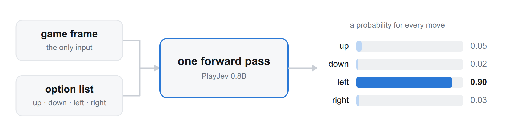

<p align="center">
  
</p>

<h1 align="center">🕹️ PlayJev 0.8B</h1>

<p align="center"><b>Ten classic browser games. Raw pixels in, one move out. 43 ms per decision.</b></p>

<p align="center">
  <a href="https://omnijev.github.io/PlayJev/"></a>
  <a href="https://github.com/OmniJev/PlayJev"></a>
  
  
</p>

<p align="center">
  
  
  
  
  
</p>

Qwen3.5-0.8B-Base fine-tuned to play ten classic browser games from raw pixels. One frame goes in, one forward
pass runs, one move comes out, 43 ms on an H200. The model never sees the game's state and is never told which
game it is playing. Every picture above is the trained model playing, each a frame from a recorded held-out
episode with the score it had reached by then.

- 💻 Code, harness and the ten games: [github.com/OmniJev/PlayJev](https://github.com/OmniJev/PlayJev)
- 🎮 Live demo, every game playable in the browser: [omnijev.github.io/PlayJev](https://omnijev.github.io/PlayJev/)

## 🎮 The Ten Games

One model, one prompt, ten games. Every tile opens that game on the demo with the model playing; the number
under each is its score against the teacher (1.00 = matches the teacher, 0 = random play).

<table align="center">
  <tr>
    <td align="center"><a href="https://omnijev.github.io/PlayJev/?game=invaders"><br><b>Space Invaders</b></a><br>👾 &nbsp;1.00</td>
    <td align="center"><a href="https://omnijev.github.io/PlayJev/?game=racer"><br><b>Racer</b></a><br>🏎️ &nbsp;1.00</td>
    <td align="center"><a href="https://omnijev.github.io/PlayJev/?game=sokoban"><br><b>Sokoban</b></a><br>📦 &nbsp;1.00</td>
    <td align="center"><a href="https://omnijev.github.io/PlayJev/?game=snake"><br><b>Snake</b></a><br>🐍 &nbsp;0.79</td>
    <td align="center"><a href="https://omnijev.github.io/PlayJev/?game=pacman"><br><b>Pacman</b></a><br>👻 &nbsp;0.52</td>
  </tr>
  <tr>
    <td align="center"><a href="https://omnijev.github.io/PlayJev/?game=mario"><br><b>Infinite Mario</b></a><br>🍄 &nbsp;0.32</td>
    <td align="center"><a href="https://omnijev.github.io/PlayJev/?game=tetris"><br><b>Tetris</b></a><br>🧱 &nbsp;0.30</td>
    <td align="center"><a href="https://omnijev.github.io/PlayJev/?game=flappy"><br><b>Floppy Bird</b></a><br>🐦 &nbsp;0.16</td>
    <td align="center"><a href="https://omnijev.github.io/PlayJev/?game=breakout"><br><b>Breakout</b></a><br>🧊 &nbsp;0.14</td>
    <td align="center"><a href="https://omnijev.github.io/PlayJev/?game=2048"><br><b>2048</b></a><br>🔢 &nbsp;0.13</td>
  </tr>
</table>

## 🏆 Scores

16 held-out episodes per game, argmax move, episodes capped at 1500 steps. Random play and the teacher run the
same seeds through the same harness. **vs teacher** is (model - random) / (teacher - random), so 0 is random
play and 1.00 is the teacher. In the chart the light bars are behaviour cloning and the first DAgger round, the
dark bar is this release.

<p align="center">
  
</p>

| Game | Random | PlayJev | Teacher | vs teacher |
|---|---:|---:|---:|---:|
| 👾 Space Invaders | 215 | **400** | 400 | 1.00 |
| 🏎️ Racer | 238 | **6707** | 6712 | 1.00 |
| 📦 Sokoban | 6.6 | **102.1** | 102.2 | 1.00 |
| 🐍 Snake | 1.0 | **89.5** | 114 | 0.79 |
| 👻 Pacman | 113 | **3702** | 7026 | 0.52 |
| 🍄 Infinite Mario | 613 | **1764** | 4229 | 0.32 |
| 🧱 Tetris | 162 | **4718** | 15288 | 0.30 |
| 🐦 Floppy Bird | 0.0 | **13.8** | 84.0 | 0.16 |
| 🧊 Breakout | 496 | **2712** | 16547 | 0.14 |
| 🔢 2048 | 1021 | **3386** | 19593 | 0.13 |
| **mean** | | | | **0.53** |

## 🧠 How It Decides

The model never sees a game's name. It sees the current frame and the list of moves, and it answers with one
of them.

<p align="center">
  
</p>

The input is the current frame and the list of moves, rendered with the frozen OpenJev prompt. The answer is
the single token after `Answer:`, and the probability over moves is the softmax over the option letters at
that position: one forward pass, no sampling, nothing generated. Moves are shuffled in every training sample,
so position carries no information. Where velocity matters the vision tower also takes the previous frame, at
no extra token cost.

<p align="center">
  
</p>

The demo's single game view is the whole model in one picture: the frame on the left is the only input, the
bars are what the forward pass returns, the line below them is how sure it was at every step so far.

```python
from playjev.model import PlayJevModel      # github.com/OmniJev/PlayJev

model = PlayJevModel("OmniJev/PlayJev-0.8B").load()
d = model.decide([frame], options)[0]       # one forward pass, a probability per move
d.choice, d.probs, d.confidence             # the move it takes, the distribution, how sure it is
```

The prompt, the readout and the option format are built in
[playjev/model.py](https://github.com/OmniJev/PlayJev/blob/main/playjev/model.py), and the demo prints the exact
prompt for every game.

## 🏋️ Training

<table align="center">
  <tr>
    <td align="center" width="33%">🤖<br><b>Ten teachers</b><br>one program per game plays on the internal state<br>and labels every frame with a soft target</td>
    <td align="center" width="33%">📸<br><b>863k frames</b><br>behaviour cloning, one epoch,<br>full fine-tuning of the 0.8B base</td>
    <td align="center" width="33%">🔁<br><b>Two DAgger rounds</b><br>the model plays 40k frames per game,<br>the teachers relabel what it visited</td>
  </tr>
</table>

One program per game (BFS, expectimax, placement search, A* with deadlock pruning, physics search) plays on
the game's internal state and labels frames with a soft target. The model trains on 863k such frames, then on
two DAgger rounds where it plays 40k frames per game and the teachers relabel what it visited. Full
fine-tuning, one epoch per round, batch 64, learning rate 2e-5, fp32 master weights with bf16 autocast.
The trainer is [playjev/train_sft.py](https://github.com/OmniJev/PlayJev/blob/main/playjev/train_sft.py).

## ⚠️ Limits

- 🏃 **Motion from a single frame** (Breakout, Mario): one still frame shows no velocity.
- 🎯 **Single-step precision** (Floppy Bird, Tetris): one move a step early ends the episode.
- 🔍 **Reading tile digits at 448 px** (2048): still open.
- ⏱️ **Latency**: one step of delay, which is what real time costs at 83 to 100 ms per step, takes the reflex games apart.

## 📄 Licence

Apache-2.0, same as the base model. The ten games are other people's work and stay in the code repository
under their own licences.
